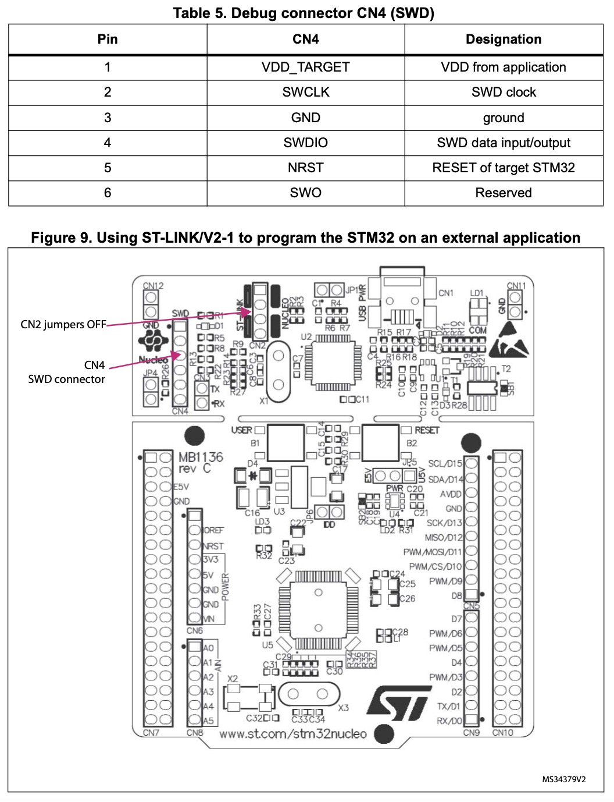
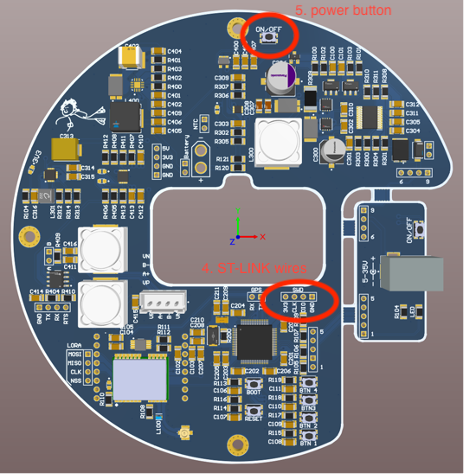

# SCUPA-Buoy

As part of the SCUPA (Super Cool Underwater Positioning Apperatus) project, the buoy is meant to be a communications bridge between the wearable and base station as well as provide the wearable with live gps data.

## How to use

1. Download the project and import `Buoy_Mainboard_V1.ioc` in [STM32CubeIDE](https://www.st.com/en/development-tools/stm32cubeide.html)
2. You will need an ST-LINK to program/debug the STM32 on the buoy pcb, in this example a nucleo board is used
3. Disconnect the specified jumpers on the ST-LINK
4. Connect the specified wires between the buoy pcb and ST-LINK
5. Make sure the buoy is powered on
6. You can now program and debug the buoy

  

## External libraries

* NMEA gps message parsing: https://github.com/sztvka/stm32-nmea-gps-hal
* Ra-02 LoRa module driver: https://github.com/SMotlaq/LoRa

## Other SCUPA parts

* Wearable: https://github.com/pip12345/SCUPA-Wearable
* Base station: *yet to be published*